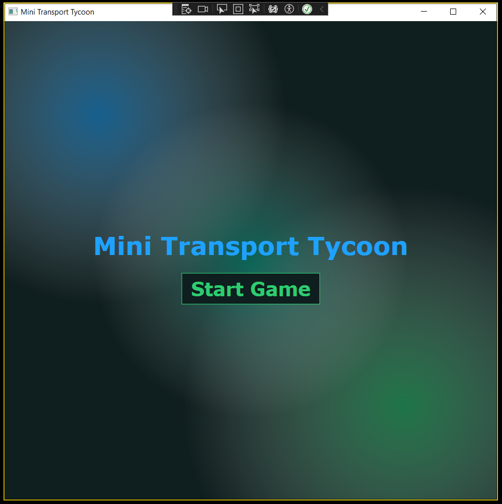
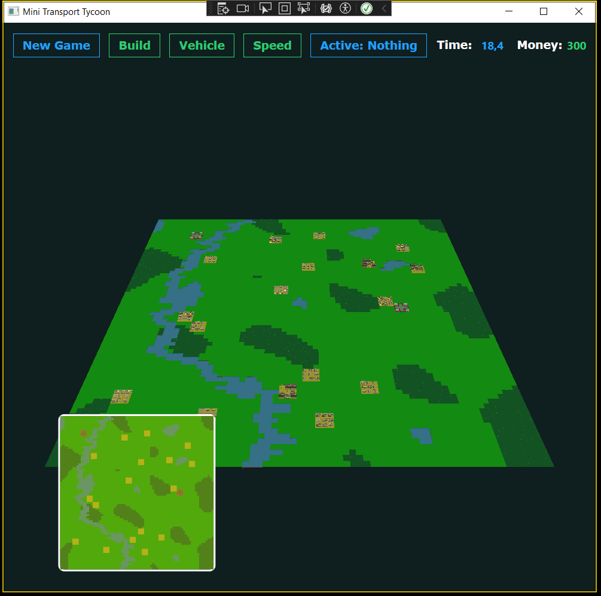
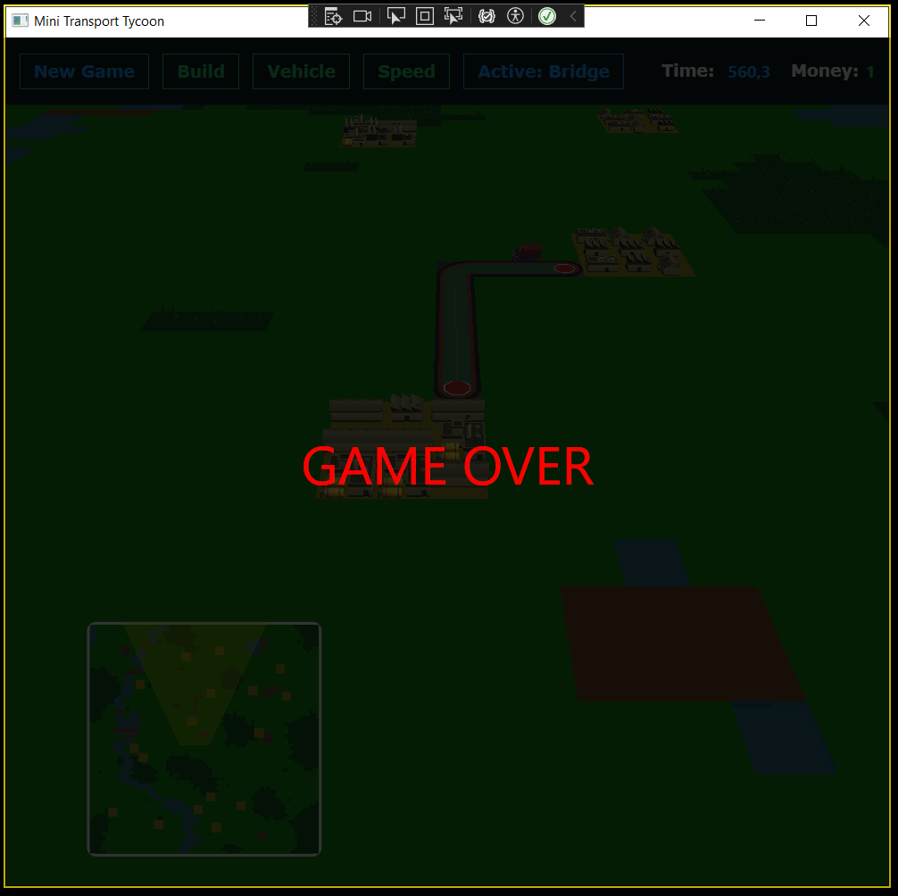

# Mini Transport Tycoon - KözlekedIK

A **Mini Transport Tycoon** a Szoftvertechnológia gyakorlat keretein belül készült közlekedési-gazdasági szimulátor a 2025/2026-os tavaszi félévben. A projekt célja egy olyan rendszer megalkotása, ahol a játékos városok és ipari létesítmények között szervez áruszállítást és személyforgalmat a profit maximalizálása érdekében.

## Demo videó
A program legfrissebb videója [ezen a linken](https://streamable.com/zm6fnq) érhetőek el.

## Alapjáték leírása
A játék egy rácsalapú térképen zajlik, ahol városok és ipari létesítmények találhatóak. A játékos feladata az infrastruktúra kiépítése és a logisztika menedzselése:
* **Útépítés**: Utakat építhetünk az üres mezőkre, melyeken a járművek közlekednek.
* **Megállók**: A városok és üzemek szélén megállókat helyezhetünk el a be- és kirakodáshoz.
* **Gazdaság**: Kezdőtőkével indulunk, bevételeink a sikeres szállításokból származnak, míg az építkezés és a járművek fenntartása költséggel jár.
* **Szállítmányozás**: Legalább 5-féle árutípus és utasok szállítása lehetséges.
* **Termelési láncok**: A rendszer tartalmaz komplex láncokat, ahol az egyik üzem terméke a másik alapanyaga.

## Irányítás és Időkezelés
A játék valós időben fut, az idő múlása pedig négy fokozatban állítható:
* **Szünet**: A szimuláció megállítása.
* **Normál**: Alapértelmezett sebesség.
* **Gyorsított / Jelentősen gyorsított**: 2-szeres vagy 4-szeres sebesség a gyorsabb haladásért.

## Választott feladatok
* **3D grafika**: Az alap 2D-s elvárás helyett a játék forgatható 3 dimenziós megjelenítéssel rendelkezik.
* **Térképgenerálás**: A pálya procedurális algoritmus (pl. Perlin Noise) segítségével, logikai szabályok mentén generálódik.
* **Városnövekedés**: A városok az idővel, a forgalom függvényében növekednek, új épületeket és utakat hozva létre a szomszédos mezőkön.
* **Erdők**: A mezőkön fák találhatóak, melyek száma idővel nőhet és terjedhet, az útépítés ilyenkor extra irtási költséggel jár.
* **Folyók és tavak**: A térképen vízfelületek találhatóak, melyeken 3 különböző típusú híddal kelhetünk át.
* **Folyamatos mozgás**: A járművek mozgása a mezők között animált és folyamatos, nem ugrásszerű.
* **Minimap**: A nagy méretű pályán való tájékozódást egy külön navigálható minimap segíti.

## Képernyőképek a játékból

### Menü

### Játék

### Játék vége

	